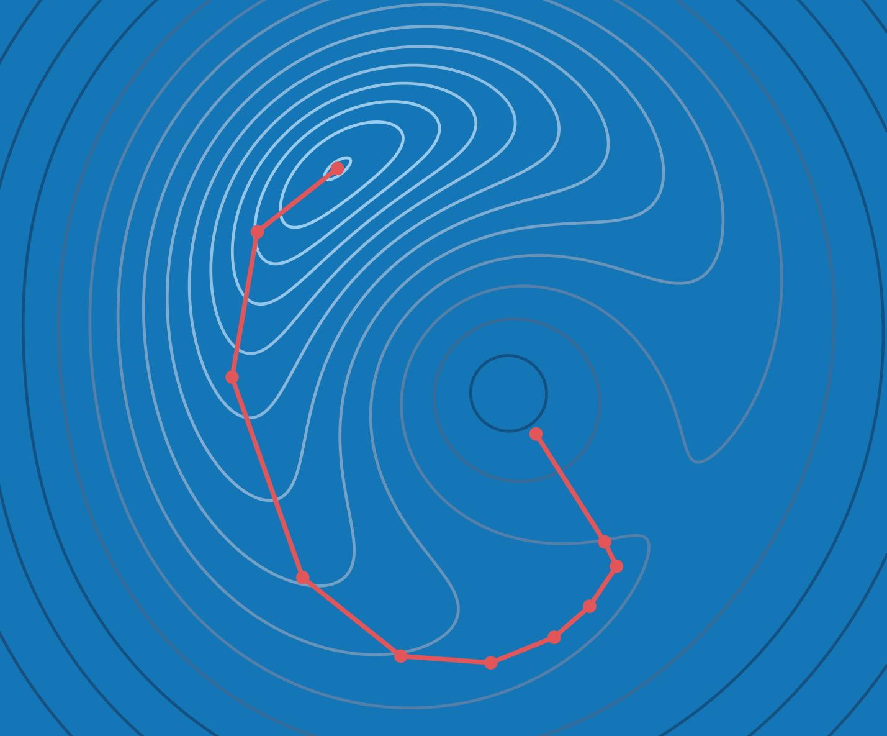
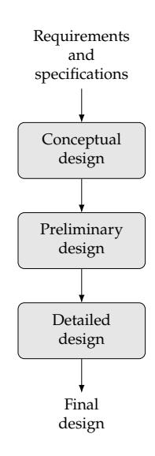
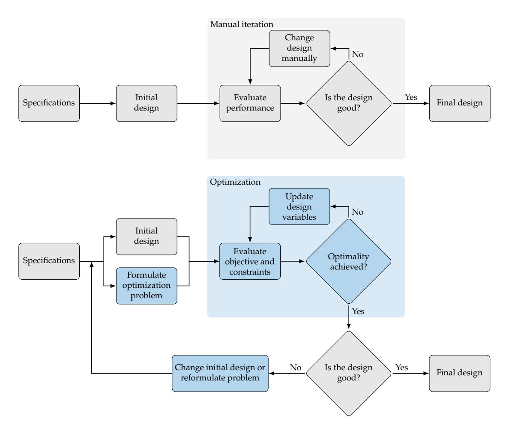
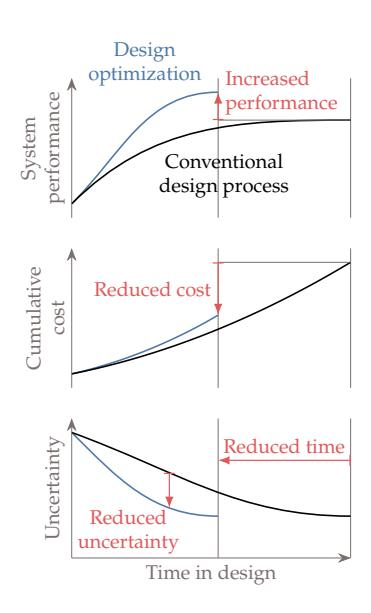
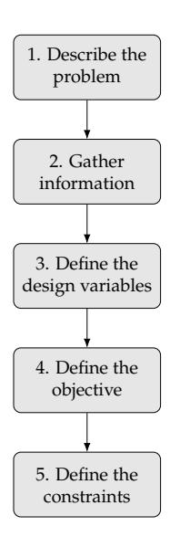
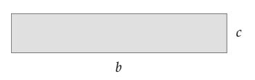
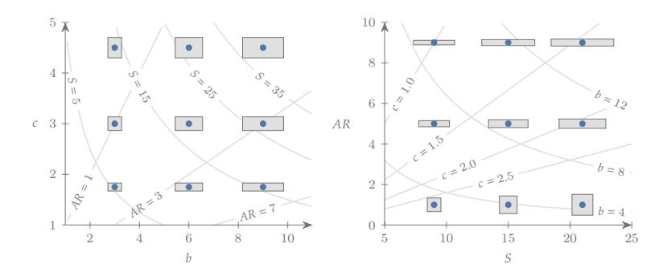
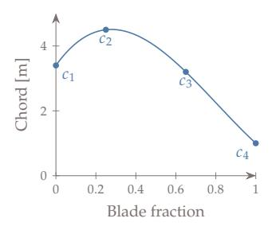

Joaquim R. R. A. Martins Andrew Ning

# **Engineering Design Optimization**

joaquim r. r. a. martins

University of Michigan

andrew ning

Brigham Young University

This is the electronic version of the book, which is available on the following webpage:

<https://mdobook.github.io>

The page numbers have been adjusted to match those of the printed book, which is available at:

[https://www.cambridge.org/us/academic/subjects/](https://www.cambridge.org/us/academic/subjects/engineering/control-systems-and-optimization/engineering-design-optimization) [engineering/control-systems-and-optimization/](https://www.cambridge.org/us/academic/subjects/engineering/control-systems-and-optimization/engineering-design-optimization) [engineering-design-optimization](https://www.cambridge.org/us/academic/subjects/engineering/control-systems-and-optimization/engineering-design-optimization)

Please cite this book as:

Joaquim R. R. A. Martins and Andrew Ning. *Engineering Design Optimization*. Cambridge University Press, 2021. ISBN: 9781108833417.

#### **Copyright**

© 2025 Joaquim R. R. A. Martins and Andrew Ning. All rights reserved.

#### **Publication**

First electronic edition: January 2020.

## Contents

|                   | Contents v                                            |  |
|-------------------|----------------------------------------------------------|--|
| Preface           | xi                                                       |  |
|                   | Acknowledgements xiii                                 |  |
| Introduction 1 |                                                          |  |
| 1.1               | Design Optimization Process 2                         |  |
| 1.2               | Optimization Problem Formulation 6                    |  |
| 1.3               | Optimization Problem Classification 17                |  |
| 1.4               | Optimization Algorithms 21                            |  |
| 1.5               | Selecting an Optimization Approach 26                 |  |
| 1.6               | Notation 28                                           |  |
| 1.7               | Summary 29                                            |  |
|                   | Problems 30                                           |  |
|                   | A Short History of Optimization 33                    |  |
| 2.1               | The First Problems: Optimizing Length and Area 33     |  |
| 2.2               | Optimization Revolution: Derivatives and Calculus 34  |  |
| 2.3               | The Birth of Optimization Algorithms 36               |  |
| 2.4               | The Last Decades 39                                   |  |
| 2.5               | Toward a Diverse Future 43                            |  |
| 2.6               | Summary 45                                            |  |
|                   | Numerical Models and Solvers 47                       |  |
| 3.1               | Model Development for Analysis versus Optimization 47 |  |
| 3.2               | Modeling Process and Types of Errors 48               |  |
| 3.3               | Numerical Models as Residual Equations 50             |  |
| 3.4               | Discretization of Differential Equations 52           |  |
| 3.5               | Numerical Errors 53                                   |  |
| 3.6               | Overview of Solvers 61                                |  |
| 3.7               | Rate of Convergence 63                                |  |
| 3.8               | Newton-Based Solvers 66                               |  |
| 3.9               | Models and the Optimization Problem 70                |  |

*Contents* vi

|   | 3.10       | Summary 73                                                                                        |
|---|------------|------------------------------------------------------------------------------------------------------|
|   |            | Problems 75                                                                                       |
|   |            |                                                                                                      |
| 4 |            | Unconstrained Gradient-Based Optimization 79                                                      |
|   | 4.1        | Fundamentals 80                                                                                   |
|   | 4.2        | Two Overall Approaches to Finding an Optimum 94                                                   |
|   | 4.3        | Line Search 96                                                                                    |
|   | 4.4        | Search Direction 110                                                                              |
|   | 4.5        | Trust-Region Methods 139                                                                          |
|   | 4.6        | Summary 147                                                                                       |
|   |            | Problems 149                                                                                      |
| 5 |            | Constrained Gradient-Based Optimization 153                                                       |
|   | 5.1        | Constrained Problem Formulation 154                                                               |
|   | 5.2        | Understanding n-Dimensional Space 156                                                          |
|   | 5.3        | Optimality Conditions 158                                                                         |
|   | 5.4        | Penalty Methods 175                                                                               |
|   | 5.5        | Sequential Quadratic Programming 187                                                              |
|   | 5.6        | Interior-Point Methods 204                                                                        |
|   | 5.7        | Constraint Aggregation 211                                                                        |
|   | 5.8        | Summary 214                                                                                       |
|   |            | Problems 215                                                                                      |
|   |            |                                                                                                      |
| 6 |            | Computing Derivatives 223                                                                         |
|   | 6.1 6.2 | Derivatives, Gradients, and Jacobians 223 Overview of Methods for Computing Derivatives 225 |
|   |            |                                                                                                      |
|   | 6.3 6.4 | Symbolic Differentiation 226 Finite Differences 227                                         |
|   | 6.5        | Complex Step 232                                                                                  |
|   | 6.6        | Algorithmic Differentiation 237                                                                   |
|   | 6.7        | Implicit Analytic Methods—Direct and Adjoint 252                                                  |
|   | 6.8        | Sparse Jacobians and Graph Coloring 262                                                           |
|   | 6.9        | Unified Derivatives Equation 265                                                                  |
|   | 6.10       | Summary 275                                                                                       |
|   |            | Problems 277                                                                                      |
|   |            |                                                                                                      |
| 7 | 7.1        | Gradient-Free Optimization 281 When to Use Gradient-Free Algorithms 281                     |
|   | 7.2        | Classification of Gradient-Free Algorithms 284                                                    |
|   | 7.3        | Nelder–Mead Algorithm 287                                                                         |
|   |            |                                                                                                      |
|   | 7.4        | Generalized Pattern Search 292                                                                    |
|   | 7.5        | DIRECT Algorithm 298                                                                              |
|   | 7.6        | Genetic Algorithms 306                                                                            |

*Contents* vii

|    | 7.7                                 | Particle Swarm Optimization 316             |  |  |  |  |
|----|-------------------------------------|------------------------------------------------|--|--|--|--|
|    | 7.8                                 | Summary 321                                 |  |  |  |  |
|    |                                     | Problems 323                                |  |  |  |  |
| 8  | Discrete Optimization 327        |                                                |  |  |  |  |
|    | 8.1                                 | Binary, Integer, and Discrete Variables 327 |  |  |  |  |
|    | 8.2                                 | Avoiding Discrete Variables 328             |  |  |  |  |
|    | 8.3                                 | Branch and Bound 330                        |  |  |  |  |
|    | 8.4                                 | Greedy Algorithms 337                       |  |  |  |  |
|    | 8.5                                 | Dynamic Programming 339                     |  |  |  |  |
|    | 8.6                                 | Simulated Annealing 347                     |  |  |  |  |
|    | 8.7                                 | Binary Genetic Algorithms 351               |  |  |  |  |
|    | 8.8                                 | Summary 351                                 |  |  |  |  |
|    |                                     | Problems 352                                |  |  |  |  |
| 9  |                                     | Multiobjective Optimization 355             |  |  |  |  |
|    | 9.1                                 | Multiple Objectives 355                     |  |  |  |  |
|    | 9.2                                 | Pareto Optimality 357                       |  |  |  |  |
|    | 9.3                                 | Solution Methods 358                        |  |  |  |  |
|    | 9.4                                 | Summary 369                                 |  |  |  |  |
|    |                                     | Problems 370                                |  |  |  |  |
| 10 | Surrogate-Based Optimization 373 |                                                |  |  |  |  |
|    | 10.1                                | When to Use a Surrogate Model 374           |  |  |  |  |
|    | 10.2                                | Sampling 375                                |  |  |  |  |
|    | 10.3                                | Constructing a Surrogate 384                |  |  |  |  |
|    | 10.4                                | Kriging 400                                 |  |  |  |  |
|    | 10.5                                | Deep Neural Networks 408                    |  |  |  |  |
|    | 10.6                                | Optimization and Infill 414                 |  |  |  |  |
|    | 10.7                                | Summary 418                                 |  |  |  |  |
|    |                                     | Problems 420                                |  |  |  |  |
| 11 | Convex Optimization 423          |                                                |  |  |  |  |
|    | 11.1                                | Introduction 423                            |  |  |  |  |
|    | 11.2                                | Linear Programming 425                      |  |  |  |  |
|    | 11.3                                | Quadratic Programming 427                   |  |  |  |  |
|    | 11.4                                | Second-Order Cone Programming 429           |  |  |  |  |
|    | 11.5                                | Disciplined Convex Optimization 430         |  |  |  |  |
|    | 11.6                                | Geometric Programming 434                   |  |  |  |  |
|    | 11.7                                | Summary 437                                 |  |  |  |  |
|    |                                     | Problems 438                                |  |  |  |  |
|    |                                     |                                                |  |  |  |  |

*Contents* viii

12 Optimization Under Uncertainty 441

|    | 12.1                          | Robust Design 442                                    |  |  |
|----|-------------------------------|---------------------------------------------------------|--|--|
|    | 12.2                          | Reliable Design 447                                  |  |  |
|    | 12.3                          | Forward Propagation 448                              |  |  |
|    | 12.4                          | Summary 469                                          |  |  |
|    |                               | Problems 471                                         |  |  |
| 13 |                               | Multidisciplinary Design Optimization 475            |  |  |
|    | 13.1                          | The Need for MDO 475                                 |  |  |
|    | 13.2                          | Coupled Models 478                                   |  |  |
|    | 13.3                          | Coupled Derivatives Computation 501                  |  |  |
|    | 13.4                          | Monolithic MDO Architectures 510                     |  |  |
|    | 13.5                          | Distributed MDO Architectures 519                    |  |  |
|    | 13.6                          | Summary 533                                          |  |  |
|    |                               | Problems 535                                         |  |  |
| A  | Mathematics Background 539 |                                                         |  |  |
|    | A.1                           | Taylor Series Expansion 539                          |  |  |
|    | A.2                           | Chain Rule, Total Derivatives, and Differentials 541 |  |  |
|    | A.3                           | Matrix Multiplication 544                            |  |  |
|    | A.4                           | Four Fundamental Subspaces in Linear Algebra 547     |  |  |
|    | A.5                           | Vector and Matrix Norms 548                          |  |  |
|    | A.6                           | Matrix Types 550                                     |  |  |
|    | A.7                           | Matrix Derivatives 552                               |  |  |
|    | A.8                           | Eigenvalues and Eigenvectors 553                     |  |  |
|    | A.9                           | Random Variables 554                                 |  |  |
| B  |                               | Linear Solvers 559                                   |  |  |
|    | B.1                           | Systems of Linear Equations 559                      |  |  |
|    | B.2                           | Conditioning 560                                     |  |  |
|    | B.3                           | Direct Methods 560                                   |  |  |
|    | B.4                           | Iterative Methods 562                                |  |  |
| C  | Quasi-Newton Methods 571   |                                                         |  |  |
|    | C.1                           | Broyden's Method 571                                 |  |  |
|    | C.2                           | Additional Quasi-Newton Approximations 572           |  |  |
|    | C.3                           | Sherman–Morrison–Woodbury Formula 576                |  |  |
| D  | Test Problems 579          |                                                         |  |  |
|    | D.1                           | Unconstrained Problems 579                           |  |  |
|    |                               |                                                         |  |  |

D.2 Constrained Problems 586

*Contents* ix

Bibliography 591

Index 615

Revision History 638

## Preface

Despite its usefulness, design optimization remains underused in industry. One of the reasons for this is the shortage of design optimization courses in undergraduate and graduate curricula. This is changing; today, most top aerospace and mechanical engineering departments include at least one graduate-level course on numerical optimization. We have also seen design optimization increasingly used in an expanding number of industries.

The word *engineering* in the title reflects the types of problems and algorithms we focus on, even though the methods are applicable beyond engineering. In contrast to explicit analytic mathematical functions, most engineering problems are implemented in complex multidisciplinary codes that involve implicit functions. Such problems might require hierarchical solvers and coupled derivative computation. Furthermore, engineering problems often involve many design variables and constraints, requiring scalable methods.

The target audience for this book is advanced undergraduate and beginning graduate students in science and engineering. No previous exposure to optimization is assumed. Knowledge of linear algebra, multivariable calculus, and numerical methods is helpful. However, these subjects' core concepts are reviewed in an appendix and as needed in the text. The content of the book spans approximately two semesterlength university courses. Our approach is to start from the most general case problem and then explain special cases. The first half of the book covers the fundamentals (along with an optional history chapter). In contrast, the second half, from Chapter 8 onward, covers more specialized or advanced topics.

Our philosophy in the exposition is to provide a detailed enough explanation and analysis of optimization algorithms so that readers can implement a basic working version. Although we do not encourage readers to use their implementations instead of existing software for solving optimization problems, implementing a method is crucial in understanding the method and its behavior.‗ A deeper knowledge of these methods is useful for developers, researchers, and those who want to use numerical optimization more effectively. The problems at

‗ In the words of Donald Knuth: "*The ultimate test of whether I understand something is if I can explain it to a computer. I can say something to you and you'll nod your head, but I'm not sure that I explained it well. But the computer doesn't nod its head. It repeats back exactly what I tell it. In most of life, you can bluff, but not with computers.*"

*Preface* xii

the end of each chapter are designed to provide a gradual progression in difficulty and eventually require implementing the methods. Some of the problems are open-ended to encourage students to explore a given topic on their own. When discussing the various optimization techniques, we also explain how to avoid the potential pitfalls of using a particular method and how to employ it more effectively. Practical tips are included throughout the book to alert the reader to common issues encountered in engineering design optimization and how to address them.

We have created a repository with code, data, templates, and examples as a supplementary resource for this book: [https://github.](https://github.com/mdobook/resources) [com/mdobook/resources.](https://github.com/mdobook/resources) Some of the end-of-chapter exercises refer to code or data from this repository.

Go forth and optimize!

## Acknowledgments

Our workflow was tremendously enhanced by the support of Edmund Lee and Aaron Lu, who took our sketches and plots and translated them to high-quality, consistently formatted figures. The layout of this book was greatly improved based in part on a template provided by Max Opgenoord. We are indebted to many students and colleagues who provided feedback and insightful questions on our concepts, examples, lectures, and manuscript drafts. At the risk of leaving out some contributors, we wish to express particular gratitude to the following individuals who helped create examples, problems, solutions, or content that was incorporated in the book: Tal Dohn, Xiaosong Du, Sicheng He, Jason Hicken, Donald Jones, Shugo Kaneko, Taylor McDonnell, Judd Mehr, Santiago Padrón, Sabet Seraj, P. J. Stanley, and Anil Yildirim. Additionally, the following individuals provided helpful suggestions and corrections to the manuscript: Eytan Adler, Josh Anibal, Eliot Aretskin-Hariton, Alexander Coppeans, Alec Gallimore, Philip Gill, Justin Gray, Christina Harvey, John Hwang, Kevin Jacobsen, Kai James, Eirikur Jonsson, Matthew Kramer, Alexander Kleb, Michael Kokkolaras, Yingqian Liao, Sandy Mader, Marco Mangano, Giuliana Mannarino, Yara Martins, Johannes Norheim, Bernardo Pacini, Malhar Prajapati, Michael Saunders, Nikhil Shetty, Tamás Terlaky, and Elizabeth Wong. We are grateful to peer reviewers who provided enthusiastic encouragement and helpful suggestions and wish to thank our editors at Cambridge University Press, who quickly and competently offered corrections. Finally, we express our deepest gratitude to our families for their loving support.

Joaquim Martins and Andrew Ning

Optimization is a human instinct. People constantly seek to improve their lives and the systems that surround them. Optimization is intrinsic in biology, as exemplified by the evolution of species. Birds optimize their wings' shape in real time, and dogs have been shown to find optimal trajectories. Even more broadly, many laws of physics relate to optimization, such as the principle of minimum energy. As Leonhard Euler once wrote, "nothing at all takes place in the universe in which some rule of maximum or minimum does not appear."

The term *optimization* is often used to mean "improvement", but mathematically, it is a much more precise concept: finding the *best* possible solution by changing variables that can be controlled, often subject to constraints. Optimization has a broad appeal because it is applicable in all domains and because of the human desire to make things better. Any problem where a decision needs to be made can be cast as an optimization problem.

Although some simple optimization problems can be solved analytically, most practical problems of interest are too complex to be solved this way. The advent of numerical computing, together with the development of optimization algorithms, has enabled us to solve problems of increasing complexity.

By the end of this chapter, you should be able to:

- 1. Understand the design optimization process.
- 2. Formulate an optimization problem.
- 3. Identify key characteristics to classify optimization problems and optimization algorithms.
- 4. Select an appropriate algorithm for a given optimization problem.

Optimization problems occur in various areas, such as economics, political science, management, manufacturing, biology, physics, and engineering. This book focuses on the application of numerical opti-

mization to the design of engineering systems. Numerical optimization first emerged in *operations research*, which deals with problems such as deciding on the price of a product, setting up a distribution network, scheduling, or suggesting routes. Other optimization areas include optimal control and machine learning. Although we do not cover these other areas specifically in this book, many of the methods we cover are useful in those areas.

Design optimization problems abound in the various engineering disciplines, such as wing design in aerospace engineering, process control in chemical engineering, structural design in civil engineering, circuit design in electrical engineering, and mechanism design in mechanical engineering. Most engineering systems rarely work in isolation and are linked to other systems. This gave rise to the field of *multidisciplinary design optimization* (MDO), which applies numerical optimization techniques to the design of engineering systems that involve multiple disciplines.

In the remainder of this chapter, we start by explaining the design optimization process and contrasting it with the conventional design process (Section 1.1). Then we explain how to formulate optimization problems and the different types of problems that can arise (Section 1.2). Because design optimization problems involve functions of different types, these are also briefly discussed (Section 1.3). (A more detailed discussion of the numerical models used to compute these functions is deferred to Chapter 3.) We then provide an overview of the different optimization algorithms, highlighting the algorithms covered in this book and linking to the relevant sections (Section 1.4). We connect algorithm types and problem types by providing guidelines for selecting the right algorithm for a given problem (Section 1.5). Finally, we introduce the notation used throughout the book (Section 1.6).

## 1.1 Design Optimization Process

Engineering design is an iterative process that engineers follow to develop a product that accomplishes a given task. For any product beyond a certain complexity, this process involves teams of engineers and multiple stages with many iterative loops that may be nested. The engineering teams are formed to tackle different aspects of the product at different stages.

The design process can be divided into the sequence of phases shown in Fig. 1.1. Before the design process begins, we must determine the requirements and specifications. This might involve market research, an analysis of current similar designs, and interviews with potential

**Fig. 1.1** Design phases.

customers. In the conceptual design phase, various concepts for the system are generated and considered. Because this phase should be short, it usually relies on simplified models and human intuition. For more complicated systems, the various subsystems are identified. In the preliminary design phase, a chosen concept and subsystems are refined by using better models to guide changes in the design, and the performance expectations are set. The detailed design phase seeks to complete the design down to every detail so that it can finally be manufactured. All of these phases require iteration within themselves. When severe issues are identified, it may be necessary to "go back to the drawing board" and regress to an earlier phase. This is just a high-level view; in practical design, each phase may require multiple iterative processes.

Design optimization is a tool that can replace an iterative design process to accelerate the design cycle and obtain better results. To understand the role of design optimization, consider a simplified version of the conventional engineering design process with only one iterative loop, as shown in Fig. 1.2 (top). In this process, engineers make decisions at every stage based on intuition and background knowledge.

Each of the steps in the conventional design process includes human decisions that are either challenging or impossible to program into computer code. Determining the product specifications requires engineers to define the problem and do background research. The design cycle must start with an initial design, which can be based on past designs or a new idea. In the conventional design process, this initial design is analyzed in some way to evaluate its performance. This could involve numerical modeling or actual building and testing. Engineers then evaluate the design and decide whether it is good enough or not based on the results.‗ If the answer is no—which is likely to be the case for at least the first few iterations—the engineer changes the design based on intuition, experience, or trade studies. When the design is finalized when it is deemed satisfactory.

The design optimization process can be represented using a flow diagram similar to that for the conventional design process, as shown in Fig. 1.2 (bottom). The determination of the specifications and the initial design are no different from the conventional design process. However, design optimization requires a formal formulation of the optimization problem that includes the design variables that are to be changed, the objective to be minimized, and the constraints that need to be satisfied. The evaluation of the design is strictly based on numerical values for the objective and constraints. When a rigorous optimization algorithm is used, the decision to finalize the design is made only when the current

‗The evaluation of a given design in engineering is often called the *analysis*. Engineers and computer scientists also refer to it as *simulation*.

design satisfies the optimality conditions that ensure that no other design "close by" is better. The design changes are made automatically by the optimization algorithm and do not require intervention from the designer.

This automated process does not usually provide a "push-button" solution; it requires human intervention and expertise (often more expertise than in the traditional process). Human decisions are still needed in the design optimization process. Before running an optimization, in addition to determining the specifications and initial design, engineers need to formulate the design problem. This requires expertise in both the subject area and numerical optimization. The designer must decide what the objective is, which parameters can be changed, and which constraints must be enforced. These decisions have profound effects on the outcome, so it is crucial that the designer formulates the optimization problem well.

Fig. 1.2 Conventional (top) versus design optimization process (bottom).

After running the optimization, engineers must assess the design because it is unlikely that the first formulation yields a valid and practical design. After evaluating the optimal design, engineers might decide to reformulate the optimization problem by changing the objective function, adding or removing constraints, or changing the set of design variables. Engineers might also decide to increase the models' fidelity if they fail to consider critical physical phenomena, or they might decide to decrease the fidelity if the models are too expensive to evaluate in an optimization iteration.

Post-optimality studies are often performed to interpret the optimal design and the design trends. This might be done by performing parameter studies, where design variables or other parameters are varied to quantify their effect on the objective and constraints. Validation of the result can be done by evaluating the design with higher-fidelity simulation tools, by performing experiments, or both. It is also possible to compute post-optimality sensitivities to evaluate which design variables are the most influential or which constraints drive the design. These sensitivities can inform where engineers might best allocate resources to alleviate the driving constraints in future designs.

Design optimization can be used in any of the design phases shown in Fig. 1.1, where each phase could involve running one or more design optimizations. We illustrate several advantages of design optimization in Fig. 1.3, which shows the notional variations of system performance, cost, and uncertainty as a function of time in design. When using optimization, the system performance increases more rapidly compared with the conventional process, achieving a better end result in a shorter total time. As a result, the cost of the design process is lower. Finally, the uncertainty in the performance reduces more rapidly as well.

Considering multiple disciplines or components using MDO amplifies the advantages illustrated in Fig. 1.3. The central idea of MDO is to consider the interactions between components using coupled models while simultaneously optimizing the design variables from the various components. In contrast, sequential optimization optimizes one component at a time. Even when interactions are considered, sequential optimization might converge to a suboptimal result (see Section 13.1 for more details and examples).

In this book, we tend to frame problems and discussions in the context of engineering design. However, the optimization methods are general and are used in other applications that may not be design problems, such as optimal control, machine learning, and regression. In other words, we mean "design" in a general sense, where variables are changed to optimize an objective.

**Fig. 1.3** Compared with the conventional design process, MDO increases the system performance, decreases the design time, reduces the total cost, and reduces the uncertainty at a given point in time.

## 1.2 Optimization Problem Formulation

The design optimization process requires the designer to translate their intent to a mathematical statement that can then be solved by an optimization algorithm. Developing this statement has the added benefit that it helps the designer better understand the problem. Being methodical in the formulation of the optimization problem is vital because *the optimizer tends to exploit any weaknesses you might have in your formulation or model*. An inadequate problem formulation can either cause the optimization to fail or cause it to converge to a mathematical optimum that is undesirable or unrealistic from an engineering point of view—the proverbial "right answer to the wrong question".

To formulate design optimization problems, we follow the procedure outlined in Fig. 1.4. The first step requires writing a description of the design problem, including a description of the system, and a statement of all the goals and requirements. At this point, the description does not necessarily involve optimization concepts and is often vague.

The next step is to gather as much data and information as possible about the problem. Some information is already specified in the problem statement, but more research is usually required to find all the relevant data on the performance requirements and expectations. Raw data might need to be processed and organized to gather the information required for the design problem. The more familiar practitioners are with the problem, the better prepared they will be to develop a sound formulation to identify eventual issues in the solutions.

At this stage, it is also essential to identify the analysis procedure and gather information on that as well. The analysis might consist of a simple model or a set of elaborate tools. All the possible inputs and outputs of the analysis should be identified, and its limitations should be understood. The computational time for the analysis needs to be considered because optimization requires repeated analysis.

It is usually impossible to learn everything about the problem before proceeding to the next steps, where we define the design variables, objective, and constraints. Therefore, information gathering and refinement are ongoing processes in problem formulation.

#### 1.2.1 Design Variables

The next step is to identify the variables that describe the system, the *design variables*, ‗ which we represent by the column vector:

$$x = [x_1, x_2, \dots, x_{n_x}]. (1.1)$$

**Fig. 1.4** Steps in optimization problem formulation.

‗Some texts call these *decision variables* or simply *variables*.

This vector defines a given design, so different vectors correspond to different designs. The number of variables, , determines the problem's dimensionality.

The design variables must not depend on each other or any other parameter, and the optimizer must be free to choose the elements of independently. This means that in the analysis of a given design, the variables must be input parameters that remain fixed throughout the analysis process. Otherwise, the optimizer does not have absolute control of the design variables. Another possible pitfall is to define a design variable that happens to be a linear combination of other variables, which results in an ill-defined optimization problem with an infinite number of combinations of design variable values that correspond to the same design.

The choice of variables is usually not unique. For example, a square shape can be parametrized by the length of its side or by its area, and different unit systems can be used. The choice of units affects the problem's scaling but not the functional form of the problem.

The choice of design variables can affect the functional form of the objective and constraints. For example, some nonlinear relationships can be converted to linear ones through a change of variables. It is also possible to introduce or eliminate discontinuities through the choice of design variables.

A given set of design variable values defines the system's design, but whether this system satisfies all the requirements is a separate question that will be addressed with the constraints in a later step. However, it is possible and advisable to define the space of allowable values for the design variables based on the design problem's specifications and physical limitations.

The first consideration in the definition of the allowable design variable values is whether the design variables are *continuous* or *discrete*. Continuous design variables are real numbers that are allowed to vary continuously within a specified range with no gaps, which we write far

$$\underline{x}_i \le x_i \le \overline{x}_i, \quad i = 1, \dots, n_x,$$
 (1.2)

where and are lower and upper bounds on the design variables, respectively. These are also known as *bound constraints* or *side constraints*. Some design variables may be unbounded or bounded on only one side.

When all the design variables are continuous, the optimization problem is said to be continuous.† Most of this book focuses on algorithms that assume continuous design variables.

†This is not to be confused with the continuity of the objective and constraint functions, which we discuss in Section 1.3.

When one or more variables are allowed to have discrete values, whether real or integer, we have a discrete optimization problem. An example of a discrete design variable is structural sizing, where only components of specific thicknesses or cross-sectional areas are available. Integer design variables are a special case of discrete variables where the values are integers, such as the number of wheels on a vehicle. Optimization algorithms that handle discrete variables are discussed in Chapter 8.

We distinguish the design variable bounds from constraints because the optimizer has direct control over their values, and they benefit from a different numerical treatment when solving an optimization problem. When defining these bounds, we must take care not to unnecessarily constrain the design space, which would prevent the optimizer from achieving a better design that is realizable. A smaller allowable range in the design variable values should make the optimization easier. However, design variable bounds should be based on actual physical constraints instead of being artificially limited. An example of a physical constraint is a lower bound on structural thickness in a weight minimization problem, where otherwise, the optimizer will discover that negative sizes yield negative weight. Whenever a design variable converges to the bound at the optimum, the designer should reconsider the reasoning for that bound and make sure it is valid. This is because designers sometimes set bounds that limit the optimization from obtaining a better objective.

At the formulation stage, we should strive to list as many independent design variables as possible. However, it is advisable to start with a small set of variables when solving a problem for the first time and then gradually expand the set of design variables.

Some optimization algorithms require the user to provide initial design variable values. This initial point is usually based on the best guess the user can produce. This might be an already good design that the optimization refines further by making small changes. Another possibility is that the initial guess is a bad design or a "blank slate" that the optimization changes significantly.

## Example 1.1 Design variables for wing design

Consider a wing design problem where the wing planform shape is rectangular. The planform could be parametrized by the span () and the chord (), as shown in Fig. 1.5, so that = [, ]. However, this choice is not unique. Two other variables are often used in aircraft design: wing area () and wing aspect ratio (), as shown in Fig. 1.6. Because these variables are not independent ( = and = 2 /), we cannot just add them to the set

**Fig. 1.5** Wingspan () and chord ().

**Fig. 1.6** Wing design space for two different sets of design variables, = [, ] and = [, ].

of design variables. Instead, we must pick any two variables out of the four to parametrize the design because we have four possible variables and two dependency relationships.

For this wing, the variables must be positive to be physically meaningful, so we must remember to explicitly bound these variables to be greater than zero in an optimization. The variables should be bound from below by small positive values because numerical models are probably not prepared to take zero values. No upper bound is needed unless the optimization algorithm requires it.

## Tip 1.1 Use splines to parameterize curves

Many problems that involve shapes, functional distributions, and paths are sometimes implemented with a large number of discrete points. However, these can be represented more compactly with splines. This is a commonly used technique in optimization because reducing the number of design variables often speeds up an optimization with little if any loss in the model parameterization fidelity. Figure 1.7 shows an example spline describing the shape of a turbine blade. In this example, only four design variables are used to represent the curved shape.

## 1.2.2 Objective Function

To find the best design, we need an *objective function*, which is a quantity that determines if one design is better than another. This function must be a scalar that is computable for a given design variable vector . The objective function can be minimized or maximized, depending on the problem. For example, a designer might want to minimize the weight or cost of a given structure. An example of a function to be maximized could be the range of a vehicle.

**Fig. 1.7** Parameterizing the chord distribution of a wing or turbine blade using a spline reduces the number of design variables while still allowing for a wide range of shape changes.